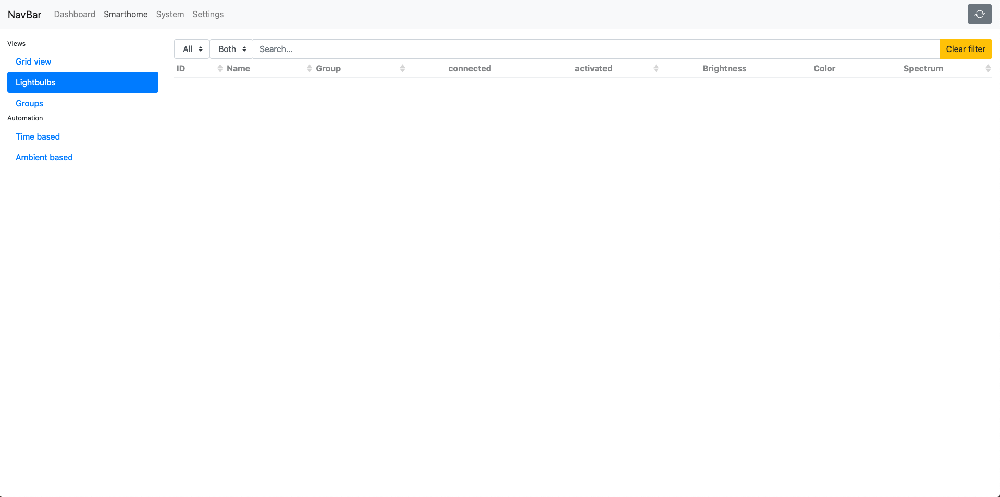

# mk-home

**mk-home** is a UI to control functions provided by the REST API of [_mk-home-server_](https://github.com/Mo0812/mk-home-server). It is able to control Tradfri devices connected to it server counterpart as well as showing common monitoring data of the system the server and API is running on. With **mk-home** one can also change several specific hardware properties like the display brightness if it is connected to the device the server is running on.

The goal of **mk-server** is to provide a general interface for several smarthome tasks based on the functions provided by [_mk-home-server_](https://github.com/Mo0812/mk-home-server). In the end it should be used to control those functions either through any device in the same network (like from smartphones, tablets, computers) as well as on the server itself by attaching a keyboard and/or a touch screen.



## Project setup

This project is still in an early development state and generally depend on using its server counterpart [_mk-home-server_](https://github.com/Mo0812/mk-home-server). In the README.md of the server application you can find more specific specs how to make it work properly.

All in all this part of the _mk-home_ project is still independet and only needs its dependecies installed via npm or yarn. After cloning this repository just go and run:

```
yarn install
```

With all dependencies you can start developing and extending the UI by running:

```
yarn serve
```

To run a minified version for production purposes do:

```
yarn build
```

Like state out above, the UI can explored by doing the steps above, but neither would show any usable data, nor is able to control any device in your network.

You need to run its according server application and connect it with the correct IP addresses in `src/components/main.js`, `src/components/store.js`, and `src/components/SystemOverviewView.vue`.

Still the server needs connection to a Tradfri gateway in your network. For furter information read [the README.md here](https://github.com/Mo0812/mk-home-server). I think about writing a blog post about in the feature which eventually will be linked here.

Nevertheless, if you like the UI or want to build something up from this, you still can make information and smarthome devices in your network available to the server in other ways and then use them trough this UI.

### Setup example

In my current setup I use a raspberry pi which is running the [_mk-home-server_](https://github.com/Mo0812/mk-home-server) via _pm2_ on it and is connected to a IKEA Tradfri gateway. The raspberry pi also running an instance of [_netdata_](https://github.com/netdata/netdata) to do some system monitoring. There is also a 7" touchscreen display attached to it.

The UI itself is running on the raspberry pi as well. By serving the compiled and minified JS files via _nginx_ every device in the local network can access the UI with a browser. In addition the Raspbian OS also shows the UI in fullscreen on the touchscreen to make it able to control the smarthome devices directly with the raspberry itself.

## Roadmap

-   [ ] Make use of `.env` files to set up all dynamic settings of the UI
-   [ ] Build up a modular plugin system to extend several standardized functions with own implementations (to easily integrate an switch like the one for the display on/off control for another device attached to the server)
